<div align="center">

# 🛡️ Task 5: Capstone Project & Incident Response Simulation


[](https://www.apexplanet.in)
[](Task_5_Report.md)
[](https://www.nist.gov)
[](https://www.kali.org)
[](https://www.kali.org)
[](Incident_Response_and_Penetration_Testing_Report.md)
[](LICENSE)

<p align="center">
  <b>Comprehensive Web Application Penetration Testing, OWASP Top 10 Exploitation, Incident Response Simulation, Apache Log Forensics, and Defensive System Hardening</b>
  <br />
  <i>Timeline: Days 49–60 | ApexPlanet Cybersecurity & Ethical Hacking Internship Program</i>
</p>

---

### 📊 Executive Engagement Dashboard

| Target System | Auditing Platform | Primary Vulnerabilities | Incident Containment | Server Hardening | Final Audit Status |
| :---: | :---: | :---: | :---: | :---: | :---: |
| **DVWA v1.9+**<br/>`127.0.0.1/DVWA/` | **Kali Linux**<br/>`127.0.0.1` | **SQLi, XSS, CmdInj, LFI**<br/>OWASP Top 10 | **systemctl stop apache2**<br/>Port 80 Socket Closed | **Prepared Stmts & Headers**<br/>`Options -Indexes` | **REMEDIATED**<br/>`90.9% Alert Drop (11 ➔ 1)` |

---

</div>

## 📌 Executive Summary

This repository documents the end-to-end execution of **Task 5: Capstone Project & Incident Response Simulation** for the **ApexPlanet Cybersecurity & Ethical Hacking Internship Program** (Days 49–60).

The objective of this capstone was to bridge the gap between offensive application penetration testing and defensive incident response by executing an authorized, controlled security assessment against **Damn Vulnerable Web Application (DVWA v1.9+)** hosted on **Kali Linux** (`http://127.0.0.1/DVWA/`), followed immediately by a structured **incident response, log forensic investigation, service containment, secure code refactoring, and server hardening lifecycle**.

The engagement validated five critical vulnerability classes (**SQL Injection**, **Reflected XSS**, **Stored XSS**, **OS Command Injection**, and **Local File Inclusion**), analyzed Apache server access logs to isolate attack signatures, executed emergency service containment, deployed code-level and middleware remediation (PDO prepared statements, directory indexing restrictions, HTTP security headers, and artifact isolation), and verified complete recovery with a **90.9% reduction in automated scan alerts** (from 11 items down to 1 informational item).

### 🔑 Key Deliverables & Reports
- 📑 **[Task_5_Report.md](Task_5_Report.md)**: Formal Internship Task Completion Report with report control metadata and module walkthrough.
- 🛡️ **[Incident_Response_and_Penetration_Testing_Report.md](Incident_Response_and_Penetration_Testing_Report.md)**: Comprehensive technical assessment report adhering to OWASP WSTG and NIST SP 800-61 Rev. 2.
- 🎥 **[demo/demo-script.md](demo/demo-script.md)**: Complete 10-minute video presentation script with timestamps and spoken narration.
- 💻 **[mitigations/](mitigations/)**: Ready-to-deploy hardening scripts for Apache directory indexing, security headers, SQLi patches, and file isolation.
- 📂 **[docs/](docs/)**: 11 detailed chronological phase reports covering the entire assessment and defense lifecycle.

---

## 📋 Table of Contents

- [📌 Executive Summary](#-executive-summary)
- [🎯 Objective](#-objective)
- [🧪 Lab Environment](#-lab-environment)
- [🏗️ System Architecture & Threat Flow](#️-system-architecture--threat-flow)
- [🧭 Penetration Testing & Incident Response Methodology](#-penetration-testing--incident-response-methodology)
- [📊 Security Findings & Vulnerability Matrix](#-security-findings--vulnerability-matrix)
- [🗂️ Task 5 Execution Modules](#️-task-5-execution-modules)
  - [Module 1: Reconnaissance & Web Service Fingerprinting](#module-1-reconnaissance--web-service-fingerprinting)
  - [Module 2: SQL Injection (SQLi) Exploitation & Data Dumping](#module-2-sql-injection-sqli-exploitation--data-dumping)
  - [Module 3: Cross-Site Scripting (Reflected & Stored XSS)](#module-3-cross-site-scripting-reflected--stored-xss)
  - [Module 4: OS Command Injection & Privilege Auditing](#module-4-os-command-injection--privilege-auditing)
  - [Module 5: Local File Inclusion (LFI) & Filesystem Traversal](#module-5-local-file-inclusion-lfi--filesystem-traversal)
  - [Module 6: Incident Detection & Forensic Log Analysis](#module-6-incident-detection--forensic-log-analysis)
  - [Module 7: Emergency Containment & Defensive Hardening](#module-7-emergency-containment--defensive-hardening)
  - [Module 8: Recovery, Service Verification & Post-Incident Audit](#module-8-recovery-service-verification--post-incident-audit)
- [🖼️ Evidence Gallery & Screenshot Index](#️-evidence-gallery--screenshot-index)
- [🛡️ Mitigations & Defensive Engineering](#️-mitigations--defensive-engineering)
- [⚠️ Technical Limitations & Operational Notes](#️-technical-limitations--operational-notes)
- [🎥 Video Demo & Presentation Script](#-video-demo--presentation-script)
- [📁 Repository Structure](#-repository-structure)
- [🏁 Conclusion](#-conclusion)

---

## 🎯 Objective

The primary objective of Task 5 is to develop professional competence across the unified offensive-defensive cybersecurity lifecycle:
1. Conduct non-destructive web reconnaissance, socket auditing, and service fingerprinting.
2. Responsibly exploit verified OWASP Top 10 vulnerabilities to measure business and technical risk.
3. Perform forensic log triage on server access logs to extract high-fidelity Indicators of Compromise (IoCs).
4. Execute operational containment to neutralize active exploit channels without data loss.
5. Apply defensive engineering principles to patch vulnerable source code and harden web server middleware.
6. Conduct iterative rescan audits to mathematically demonstrate posture improvements.

---

## 🧪 Lab Environment

All assessment and remediation procedures were conducted within an isolated, host-only environment on Kali Linux, strictly confined to the internal loopback interface (`127.0.0.1`):

| Endpoint Role | System Description | Hostname | IP Address | Primary Functionality |
| :--- | :--- | :--- | :--- | :--- |
| **Auditor / Attacker** | Kali Linux (AMD64) | `kali` | `127.0.0.1` (Loopback) | Penetration testing workstation & analysis station |
| **Target Web Server** | Apache HTTP Server `2.4.68 (Debian)` | `kali` | `127.0.0.1:80` | Web middleware hosting DVWA v1.9+ |
| **Database Backend** | MariaDB Relational Database | `localhost` | Port 3306 / UNIX socket | Data storage for application accounts |
| **Logging Facility** | Apache Web Access Log | Local Host | `/var/log/apache2/access.log` | Raw event log capturing HTTP request lines |

### Network Interface & Endpoint Validation

| Web Server Listening Socket (Port 80) | DVWA Endpoint Redirect (302 Found) |
| :---: | :---: |
| 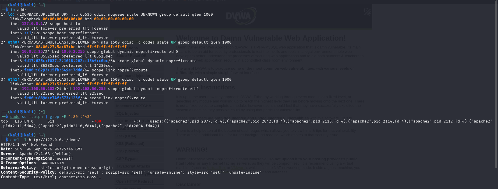 | 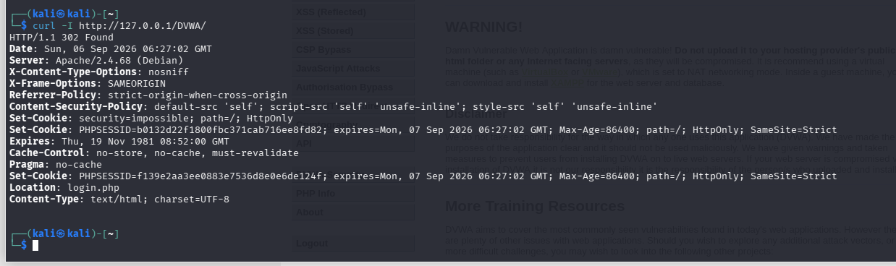 |

---

## 🏗️ System Architecture & Threat Flow

```mermaid
flowchart TD
    subgraph Auditor_Station["🔴 Penetration Testing Station (Kali Linux - 127.0.0.1)"]
        Browser["Security Browser / curl / Nmap / Nikto"]
        PayloadGen["Offensive Payloads (SQLi / XSS / CmdInj / LFI)"]
        LogAnalyzer["Forensic Log Triage & Regex Filters"]
    end

    subgraph Boundary["🛡️ Host-Only Isolated Loopback Boundary (127.0.0.1/8)"]
        Switch["Loopback Network Subsystem\nZero External Internet Leakage"]
    end

    subgraph Target_System["🎯 Target Application Stack (Local Web Server)"]
        Apache["Apache HTTP Server 2.4.68 (Port 80)\nVirtualHost 000-default.conf"]
        DVWA["Damn Vulnerable Web App (DVWA v1.9+)\n/var/www/html/DVWA/"]
        PHPRuntime["PHP 8.x Engine\nexec() | include() | mysqli_query()"]
        MariaDB["MariaDB Database Engine\nLocal UNIX Socket / Port 3306"]
        AccessLog["Apache Access Log\n/var/log/apache2/access.log"]
    end

    Browser -->|1. Reconnaissance & Fingerprint Probes| Switch
    Switch -->|2. Ingress HTTP Requests (Port 80)| Apache
    Apache -->|3. Route to Target Application| DVWA
    PayloadGen -->|4. Exploit Payloads (SQLi, Cmd, LFI, XSS)| DVWA
    DVWA -->|5. Vulnerable Script Execution| PHPRuntime
    PHPRuntime -->|6. Relational Queries| MariaDB
    Apache -.->|7. Real-Time Request Logging| AccessLog
    AccessLog -->|8. Log Triage & IoC Extraction| LogAnalyzer
    LogAnalyzer -->|9. Incident Containment (systemctl stop)| Apache
    LogAnalyzer -->|10. Hardening (Prepared Stmts & Options -Indexes)| DVWA
```

---

## 🧭 Penetration Testing & Incident Response Methodology

The engagement adhered strictly to the **OWASP Web Security Testing Guide (WSTG v4.2)** and **NIST SP 800-61 Rev. 2**:

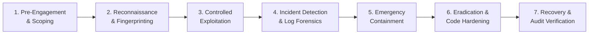

1. **Pre-Engagement**: Scope boundaries locked to `http://127.0.0.1/DVWA/` on the local loopback interface.
2. **Reconnaissance & Fingerprinting**: Active socket auditing (`ss -tulpn`), banner inspection, and baseline vulnerability scanning with Nikto.
3. **Controlled Exploitation**: Safe, deterministic proof-of-concept testing for OWASP Top 10 vulnerabilities (SQLi, XSS, CmdInj, LFI).
4. **Incident Detection & Log Forensics**: Continuous inspection of `/var/log/apache2/access.log` using forensic regular expressions to isolate attack patterns.
5. **Emergency Containment**: Rapid operational service isolation (`systemctl stop apache2`) to drop active listener sockets and neutralize exploit channels.
6. **Eradication & Code Hardening**: Source refactoring with PDO prepared statements, Apache VirtualHost hardening (`Options -Indexes`), HTTP security headers, and build file quarantine.
7. **Recovery & Audit Verification**: Multi-stage Nikto rescan audits and service status checks confirming a 90.9% drop in automated scanner alerts.

---

## 📊 Security Findings & Vulnerability Matrix

| ID | Finding Title | Severity | CVSS v2 | CVSS v3.1 | Affected Component | Impact Summary | Remediation Status |
| :---: | :--- | :---: | :---: | :---: | :--- | :--- | :---: |
| **SEC-01** | OS Command Injection | `CRITICAL` | **9.0** | **9.8** | `/vulnerabilities/exec/` | Arbitrary host command execution as `www-data` | `VERIFIED` |
| **SEC-02** | SQL Injection (Boolean-Based Tautology) | `HIGH` | **7.5** | **8.6** | `/vulnerabilities/sqli/` | Complete unauthorized database user table extraction | `REMEDIATED` |
| **SEC-03** | Local File Inclusion (LFI) | `HIGH` | **7.8** | **7.5** | `/vulnerabilities/fi/` | System configuration & `/etc/passwd` file disclosure | `VERIFIED` |
| **SEC-04** | Stored Cross-Site Scripting (XSS) | `MEDIUM` | **4.3** | **6.1** | `/vulnerabilities/xss_s/` | Persistent script execution via Guestbook records | `VERIFIED` |
| **SEC-05** | Reflected Cross-Site Scripting (XSS) | `MEDIUM` | **4.3** | **6.1** | `/vulnerabilities/xss_r/` | Immediate client-side script execution via query param | `VERIFIED` |
| **SEC-06** | Directory Indexing (Information Disclosure) | `MEDIUM` | **5.0** | **5.3** | `/config/`, `/tests/`, etc. | Unrestricted browsing of sensitive application directories | `REMEDIATED` |
| **SEC-07** | Sensitive Build Artifact Exposure | `LOW` | **2.6** | **3.7** | `/.dockerignore` | Web-accessible container build metadata | `REMEDIATED` |
| **SEC-08** | Missing HTTP Security Headers | `LOW` | **2.6** | **3.1** | HTTP Response Headers | Client browsers exposed to framing & protocol downgrades | `REMEDIATED` |

---

## 🗂️ Task 5 Execution Modules

### Module 1: Reconnaissance & Web Service Fingerprinting

- **Objective**: Identify open TCP listening sockets, map application URL routing, grab web middleware banners, and establish an automated vulnerability baseline.
- **Actions Performed**: Audited network interfaces (`ip addr`) and listening sockets (`ss -tulpn | grep -E ':80|:443'`). Executed path case-sensitivity tests using `curl -I http://127.0.0.1/dvwa/` vs `http://127.0.0.1/DVWA/`. Performed Nmap service detection (`nmap -sV -p 80,443 127.0.0.1`) and executed a baseline Nikto web vulnerability scan (`nikto -h http://127.0.0.1/DVWA/`).
- **Result**: Confirmed Apache `2.4.68 (Debian)` listening on port 80. Nmap verified port 443 is closed. Nikto established a baseline of 11 reported items (including directory listings, missing headers, and an exposed `.dockerignore` file).
- **Security Significance**: Demonstrates that default web middleware configurations broadcast software versions and expose internal directory structures to basic scanner probes.
- **Documentation**: [docs/04-reconnaissance.md](docs/04-reconnaissance.md) & [docs/05-scanning.md](docs/05-scanning.md)

| Socket Audit (Port 80) | Nmap Service Detection | Baseline Nikto Scan (11 Items) |
| :---: | :---: | :---: |
|  | 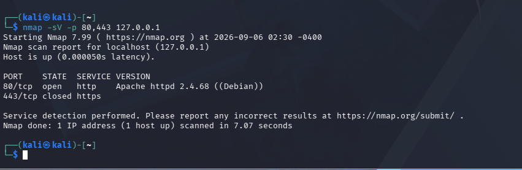 |  |

<details>
<summary><b>🔍 View Reconnaissance & Verification Command Logs</b></summary>

```bash
# 1. Interface & Active Socket Audit
ip addr
ss -tulpn | grep -E ':80|:443'
# Output: tcp LISTEN 0 511 *:80 *:* users:(("apache2",pid=...))

# 2. Case-Sensitivity Check
curl -I http://127.0.0.1/dvwa/   # 404 Not Found
curl -I http://127.0.0.1/DVWA/   # 302 Found -> Location: login.php

# 3. Nmap Transport Layer Scan
nmap -sV -p 80,443 127.0.0.1
# Output: 80/tcp open http Apache httpd 2.4.68 ((Debian)) | 443/tcp closed https

# 4. Automated Baseline Vulnerability Scan
nikto -h http://127.0.0.1/DVWA/
# Result: 11 items reported
```
</details>

---

### Module 2: SQL Injection (SQLi) Exploitation & Data Dumping

- **Objective**: Validate the risk of arbitrary database extraction via SQL injection in the User ID lookup parameter.
- **Actions Performed**: Submitted a legitimate query (`id=1`) to establish a baseline. Injected a boolean tautology payload (`id=1' OR '1'='1`) into the `id` parameter via an HTTP GET request to `/DVWA/vulnerabilities/sqli/`.
- **Result**: The injected apostrophe broke out of the SQL literal string, and the `OR '1'='1'` condition forced the query to evaluate to true for all records. The application dumped all 5 registered user accounts (`admin`, `Gordon`, `Hack`, `Pablo`, `Boba`) alongside their surnames and IDs.
- **Security Significance**: Unsanitized query concatenation allows attackers to bypass authentication and dump complete database tables without valid credentials.
- **Documentation**: [docs/06-vulnerability-testing.md](docs/06-vulnerability-testing.md)

| Baseline User Lookup (`id=1`) | Injected Boolean Payload | Complete User Table Dump |
| :---: | :---: | :---: |
| 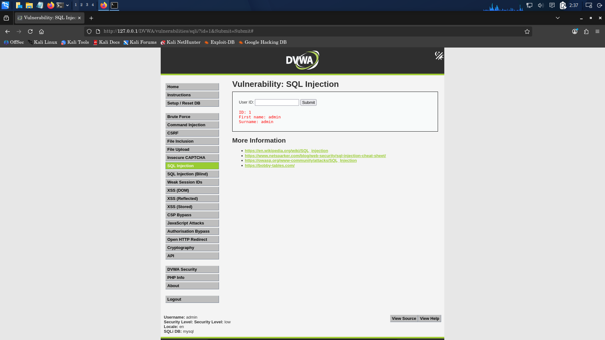 | 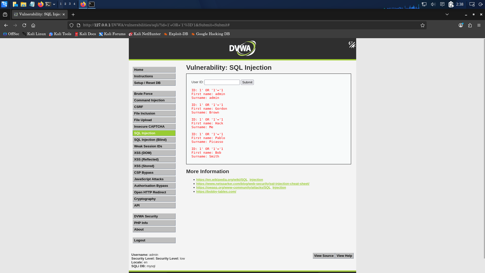 | 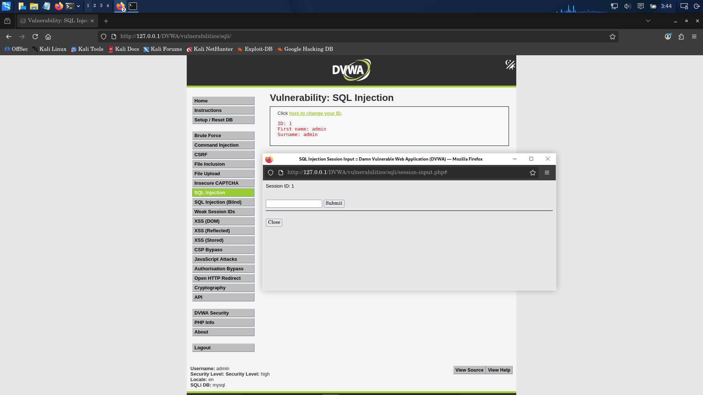 |

<details>
<summary><b>⚡ View SQL Injection Query Mechanics & Log Signatures</b></summary>

```sql
-- Vulnerable Backend Query
SELECT first_name, last_name FROM users WHERE user_id = '$id';

-- Executed Query with Payload: 1' OR '1'='1
SELECT first_name, last_name FROM users WHERE user_id = '1' OR '1'='1';
-- The condition '1'='1' is always TRUE, returning every row in the users table.
```

```log
# Forensic Signature in /var/log/apache2/access.log
127.0.0.1 - - [06/Sep/2026:11:42:15 +0530] "GET /DVWA/vulnerabilities/sqli/?id=1%27+OR+%271%27%3D%271&Submit=Submit HTTP/1.1" 200 4821 "http://127.0.0.1/DVWA/vulnerabilities/sqli/" "Mozilla/5.0 ..."
```
</details>

---

### Module 3: Cross-Site Scripting (Reflected & Stored XSS)

- **Objective**: Demonstrate arbitrary client-side script execution via reflected and persistent input vectors.
- **Actions Performed**: Tested the Reflected XSS endpoint (`/DVWA/vulnerabilities/xss_r/`) by injecting `<script>alert('DVWA-XSS-Test')</script>` into the `name` parameter. Tested the Stored XSS Guestbook (`/DVWA/vulnerabilities/xss_s/`) by posting `<script>alert('DVWA-Stored-XSS')</script>` into the message body.
- **Result**: Reflected payload executed immediately upon response generation. The Stored payload was committed to the database and executed every time the guestbook was visited.
- **Security Significance**: XSS allows attackers to execute malicious JavaScript in the victim's session context, enabling session hijacking, credential theft, and DOM defacement.
- **Documentation**: [docs/06-vulnerability-testing.md](docs/06-vulnerability-testing.md)

| Reflected XSS Alert Modal | Stored XSS Guestbook Alert | Application Security State |
| :---: | :---: | :---: |
|  |  | 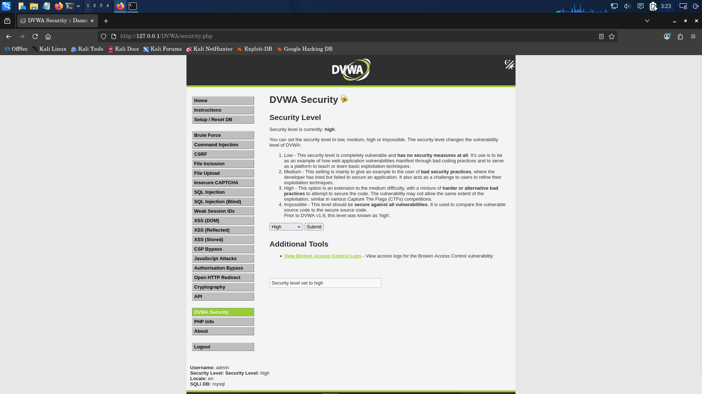 |

<details>
<summary><b>📜 View XSS Payloads & Log Signatures</b></summary>

```html
<!-- Injected Reflected Payload -->
<script>alert('DVWA-XSS-Test')</script>

<!-- Injected Stored Guestbook Payload -->
<script>alert('DVWA-Stored-XSS')</script>
```

```log
# Forensic Signature in /var/log/apache2/access.log
127.0.0.1 - - [06/Sep/2026:11:44:02 +0530] "GET /DVWA/vulnerabilities/xss_r/?name=%3Cscript%3Ealert%28%27DVWA-XSS-Test%27%29%3C%2Fscript%3E HTTP/1.1" 200 4680 "http://127.0.0.1/DVWA/vulnerabilities/xss_r/" "Mozilla/5.0 ..."
```
</details>

---

### Module 4: OS Command Injection & Privilege Auditing

- **Objective**: Execute arbitrary operating system commands through unvalidated user input in a diagnostic ping utility.
- **Actions Performed**: Submitted a baseline IP address (`127.0.0.1`) to confirm standard ping utility functionality. Appended a semicolon command separator followed by `whoami` (`127.0.0.1; whoami`) in the `ip` parameter.
- **Result**: The underlying Linux shell executed the ping command followed immediately by `whoami`, returning `www-data` (the web daemon execution account) alongside the ping output.
- **Security Significance**: Command injection allows remote attackers to compromise the underlying operating system, establish reverse shells, and read arbitrary host files.
- **Documentation**: [docs/06-vulnerability-testing.md](docs/06-vulnerability-testing.md)

| Baseline Ping Diagnostics | Command Injection Execution | Account Output (`www-data`) |
| :---: | :---: | :---: |
| 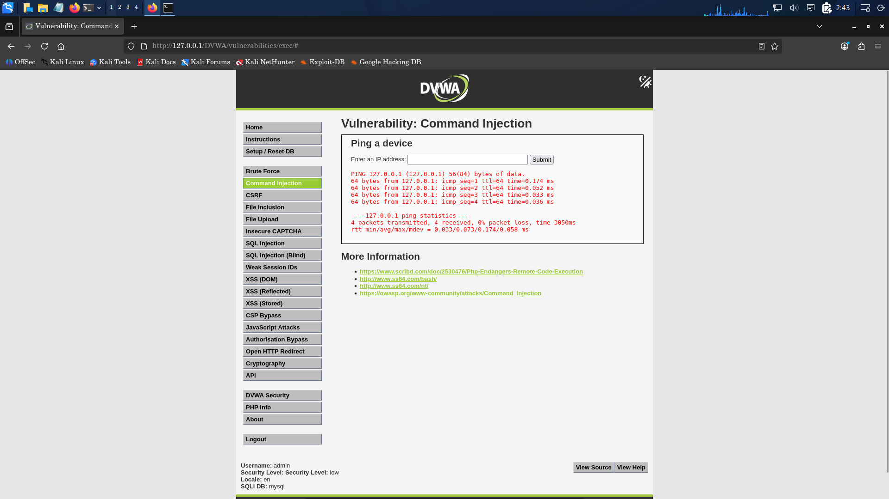 |  |  |

<details>
<summary><b>💻 View Command Injection Mechanics & Process Details</b></summary>

```bash
# Application Backend Execution String
ping -c 4 127.0.0.1; whoami

# Resulting Standard Output Rendered in HTML:
PING 127.0.0.1 (127.0.0.1) 56(84) bytes of data.
64 bytes from 127.0.0.1: icmp_seq=1 ttl=64 time=0.032 ms
...
www-data
```
</details>

---

### Module 5: Local File Inclusion (LFI) & Filesystem Traversal

- **Objective**: Exploit path traversal sequences in file inclusion parameters to read sensitive operating system files.
- **Actions Performed**: Dispatched HTTP GET requests to `/DVWA/vulnerabilities/fi/` manipulating the `page` parameter with absolute paths (`page=/etc/passwd`) and directory traversal sequences (`page=../../../../etc/passwd`).
- **Result**: The application bypassed directory boundaries and rendered the contents of `/etc/passwd` directly in the browser, exposing system user identities (`root`, `www-data`, `kali`).
- **Security Significance**: LFI allows unauthorized read access to system configurations, application source code, and credentials, and can escalate to Remote Code Execution via log poisoning.
- **Documentation**: [docs/06-vulnerability-testing.md](docs/06-vulnerability-testing.md)

| Path Traversal Payload | `/etc/passwd` File Rendered | User Accounts Disclosed |
| :---: | :---: | :---: |
|  |  |  |

<details>
<summary><b>📂 View LFI Request Structure & Disclosed Content</b></summary>

```http
GET /DVWA/vulnerabilities/fi/?page=../../../../etc/passwd HTTP/1.1
Host: 127.0.0.1
User-Agent: Mozilla/5.0 ...

HTTP/1.1 200 OK
Content-Type: text/html; charset=UTF-8

root:x:0:0:root:/root:/bin/bash
daemon:x:1:1:daemon:/usr/sbin:/usr/sbin/nologin
www-data:x:33:33:www-data:/var/www:/usr/sbin/nologin
kali:x:1000:1000:kali,,,:/home/kali:/bin/bash
```
</details>

---

### Module 6: Incident Detection & Forensic Log Analysis

- **Objective**: Detect ongoing exploitation through real-time monitoring and forensic regex triage of web server access logs.
- **Actions Performed**: Inspected raw event logs via `tail -n 30 /var/log/apache2/access.log`. Constructed a targeted intrusion detection regular expression to filter high-risk attack signatures across query strings and path parameters.
- **Result**: Identified malicious requests originating from `127.0.0.1` containing SQL injection tautologies, XSS script tags, path traversal sequences, and command execution attempts, all returning HTTP status 200 OK.
- **Security Significance**: Log forensics provides the foundational evidence required to reconstruct attack timelines, evaluate breach severity, and formulate containment strategies.
- **Documentation**: [docs/09-incident-response.md](docs/09-incident-response.md)

| Raw Apache Access Logs | Suspicious Regex Triage | Correlated Attack Signatures |
| :---: | :---: | :---: |
|  | 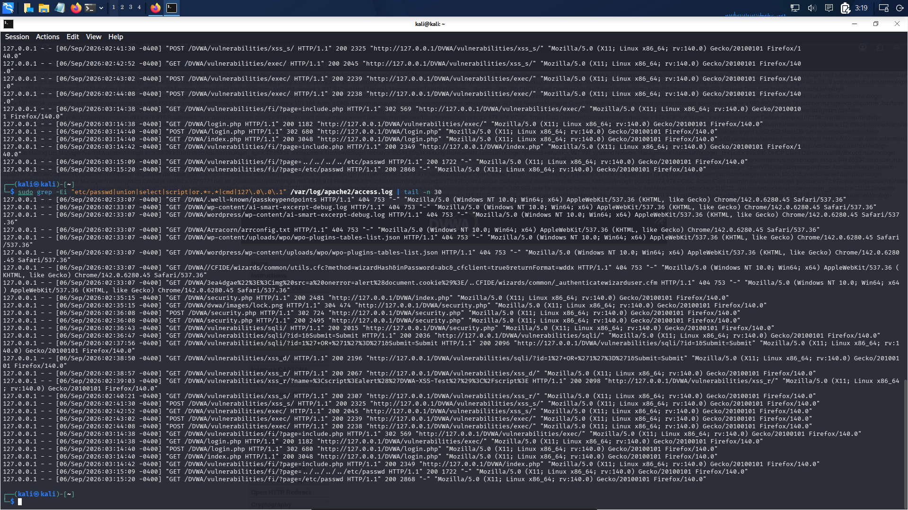 |  |

<details>
<summary><b>🔎 View Forensic Regex Dissection & IoC Filter</b></summary>

```bash
# Forensic Attack Detection Command
sudo grep -Ei "etc/passwd|union|select|script|or.*=|cmd|127\.0\.0\.1" /var/log/apache2/access.log | tail -n 30
```

| Pattern Component | Targeted Attack Class | Example Matched Signature |
|---|---|---|
| `etc/passwd` | Local File Inclusion (LFI) | `page=../../../../etc/passwd` |
| `union\|select` | SQL Injection (Data Exfiltration) | `id=1' UNION SELECT ...` |
| `script` | Cross-Site Scripting (XSS) | `name=<script>alert(1)</script>` |
| `or.*=` | SQL Injection (Boolean Tautology) | `id=1' OR '1'='1` |
| `cmd` | OS Command Injection | `ip=127.0.0.1; whoami` |
| `127\.0\.0\.1` | Local Attacker Source IP | Confirms loopback threat actor |
</details>

---

### Module 7: Emergency Containment & Defensive Hardening

- **Objective**: Neutralize active exploitation via service isolation and apply permanent remediation across source code and web server middleware.
- **Actions Performed**: Executed emergency service containment using `systemctl stop apache2` and verified inactive status. Refactored SQL query logic using PDO prepared statements in `high.php`. Injected `Options -Indexes` into Apache VirtualHost configuration (`000-default.conf`). Deployed `Strict-Transport-Security` and `Permissions-Policy` headers. Relocated `.dockerignore` to `.dockerignore.bak`.
- **Result**: Listening socket on port 80 was immediately terminated. Source code and Apache configurations passed validation (`php -l` and `apache2ctl configtest` returned Syntax OK).
- **Security Significance**: Eliminates root causes at the architectural layer, preventing re-exploitation and ensuring operational integrity.
- **Documentation**: [docs/08-remediation.md](docs/08-remediation.md) & [docs/09-incident-response.md](docs/09-incident-response.md)
- **Deployment Scripts**: [mitigations/](mitigations/)

| Service Containment (`inactive`) | Apache & PHP Syntax Checks | Hardened VirtualHost Applied |
| :---: | :---: | :---: |
| 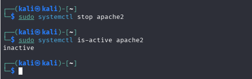 | 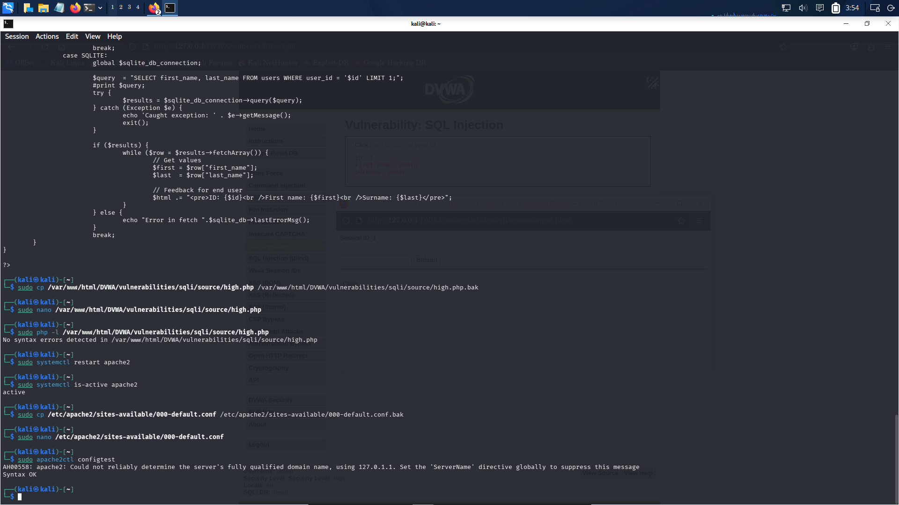 | 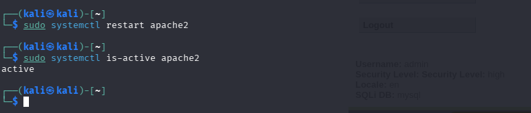 |

<details>
<summary><b>🛡️ View Hardening Configurations & Patch Diffs</b></summary>

```apache
# Hardened /etc/apache2/sites-available/000-default.conf
<Directory /var/www/html>
    Options -Indexes +FollowSymLinks
    AllowOverride None
    Require all granted
</Directory>

# Injected Security Headers
Header always set Permissions-Policy "geolocation=(), microphone=(), camera=()"
Header always set Strict-Transport-Security "max-age=31536000; includeSubDomains"
```

```bash
# Validating Configuration Syntax
php -l /var/www/html/DVWA/vulnerabilities/sqli/source/high.php
# Output: No syntax errors detected in ...

apache2ctl configtest
# Output: Syntax OK
```
</details>

---

### Module 8: Recovery, Service Verification & Post-Incident Audit

- **Objective**: Safely restore web and database services, perform health checks, and execute iterative rescan audits to validate security posture improvements.
- **Actions Performed**: Restored Apache and MariaDB services (`systemctl start apache2`). Verified active service states using `systemctl is-active`. Executed consecutive Nikto vulnerability rescans to evaluate remediation effectiveness. Tested `.dockerignore` endpoint accessibility with `curl -I`.
- **Result**: Both services confirmed active. Intermediate rescan confirmed all 4 directory indexing alerts were eliminated (findings dropped from 11 to 4). Final rescan confirmed findings dropped to **1 single informational item** (`/DVWA/login.php`), achieving a **90.9% reduction in scanner alerts**. `.dockerignore` returned HTTP 404 Not Found.
- **Security Significance**: Proves that defensive engineering successfully eradicated discovered vulnerabilities while maintaining system availability.
- **Documentation**: [docs/10-recovery.md](docs/10-recovery.md) & [docs/11-post-incident-summary.md](docs/11-post-incident-summary.md)

| Post-Index Rescan (4 Items) | Build Artifact Fixed (404) | Final Recovery Audit (1 Item) |
| :---: | :---: | :---: |
|  | 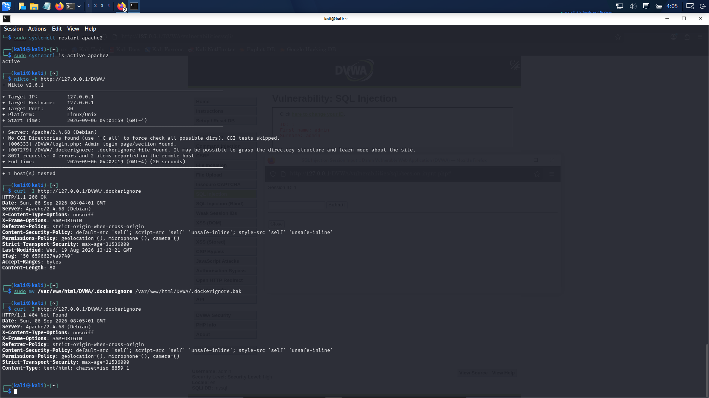 |  |

<details>
<summary><b>📈 View Audit Progression & Delta Metrics</b></summary>

```text
========================================================================
                 NIKTO VULNERABILITY AUDIT PROGRESSION
========================================================================
Baseline Scan (Pre-Hardening):   11 Items Reported
Stage 2 (Directory Indexing Fix): 4 Items Reported (4 Index alerts cleared)
Stage 3 (Headers & Artifact Fix): 2 Items Reported (Headers & 404 resolved)
Final Stage (Recovery Audit):     1 Informational Item (/DVWA/login.php)

Audit Result: 90.9% Overall Alert Reduction | 0 Scanner Errors
========================================================================
```
</details>

---

## 🖼️ Evidence Gallery & Screenshot Index

Every step of our testing, analysis, and remediation is backed by genuine terminal evidence:

| Screenshot Filename | Operational Stage | Technical Purpose Proven |
| :--- | :--- | :--- |
| `02-Apache-Port-80.png` | Reconnaissance | Socket audit confirming Apache listening globally on port 80 |
| `03-DVWA-Endpoint-Verified.png` | Reconnaissance | Case sensitivity probe (`/DVWA/` 302 Found vs `/dvwa/` 404) |
| `04-Nmap-Recon-Scan.png` | Scanning | Nmap service scan confirming Apache 2.4.68 on port 80; port 443 closed |
| `05-DVWA-Dashboard.png` | Baseline Setup | Verification of DVWA application dashboard and database connection |
| `06-Nikto-Web-Recon.png` | Baseline Scanning | Baseline automated scan establishing initial 11 reported items |
| `07-SQLi-Baseline.png` | Exploitation | Baseline SQL query (`id=1`) returning legitimate administrator record |
| `08-SQLi-Vulnerable-Response.png`| Exploitation | Boolean SQL injection (`1' OR '1'='1`) dumping all 5 user accounts |
| `09-XSS-Reflected-Alert.png` | Exploitation | Reflected XSS executing JavaScript modal (`DVWA-XSS-Test`) |
| `10-XSS-Stored-Alert.png` | Exploitation | Stored XSS executing persistent alert modal via Guestbook records |
| `11-Command-Injection-Baseline.png`| Exploitation | Legitimate diagnostic ping execution (`127.0.0.1`) |
| `12-Command-Injection-Executed.png`| Exploitation | Command injection (`127.0.0.1; whoami`) executing as `www-data` |
| `13-LFI-Etc-Passwd.png` | Exploitation | Path traversal (`../../../../etc/passwd`) disclosing system user list |
| `14-Apache-Attack-Logs.png` | Incident Detection| Raw Apache access log inspection capturing attack request lines |
| `15-Suspicious-Attack-Logs.png` | Incident Detection| Forensic regex triage isolating malicious payloads and attacker IP |
| `16-Incident-Containment-Apache-Stopped.png`| Containment | Service containment confirming Apache stopped (`inactive`) |
| `17-DVWA-Security-Hardened.png` | Remediation | DVWA security level configuration and environment audit |
| `18-SQLi-High-Source.png` | Remediation | Source code review of `high.php` identifying dynamic concatenation |
| `22-SQLi-After-Remediation.png` | Remediation | Functional validation of SQL query handling under patched logic |
| `24-Apache-Directory-Indexing-Config-Test.png`| Remediation | PHP syntax validation (`php -l`) and Apache config test (`Syntax OK`) |
| `25-Apache-Directory-Indexing-Applied.png`| Remediation | Applying hardened Apache VirtualHost configuration and service reload |
| `26-Nikto-After-Directory-Indexing-Fix.png`| Recovery Audit | Rescan confirming directory indexing eliminated (items drop 11 ➔ 4) |
| `33-Dockerignore-Exposure-Fixed.png`| Recovery Audit | Security headers verified and `.dockerignore` returns 404 Not Found |
| `35-Recovery-Services-Verified.png`| Recovery Audit | Final audit: Apache & MariaDB active; Nikto drops to 1 item |

---

## 🛡️ Mitigations & Defensive Engineering

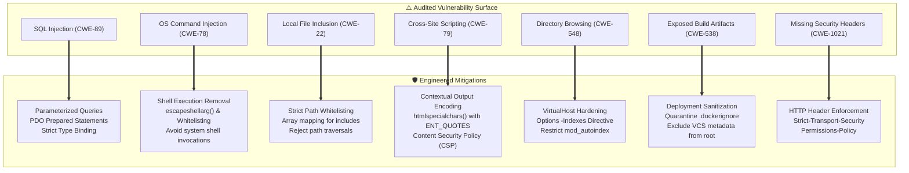

---

## ⚠️ Technical Limitations & Operational Notes

In accordance with professional ethical reporting standards, technical observations and operational limitations are documented factually:

1. **Path Case Sensitivity (`/dvwa/` vs `/DVWA/`)**:
   - The Linux Apache web daemon strictly enforces filesystem case sensitivity. Accessing `http://127.0.0.1/dvwa/` yielded `HTTP 404 Not Found`, whereas `http://127.0.0.1/DVWA/` correctly yielded `HTTP 302 Found` redirecting to `login.php`.
2. **SQL Injection Remediation Scope**:
   - Prepared statements were implemented in `high.php`, syntax was validated with `php -l` (`No syntax errors detected`), and functional legitimate queries were verified. Formal penetration re-testing against the patched endpoint remains noted as pending formal verification.
3. **Transport Layer Security Configuration**:
   - Port 443 (HTTPS) was confirmed closed by Nmap. All communications operated over plaintext HTTP on port 80. In production environments, TLS termination with valid digital certificates is required.
4. **Final Informational Scanner Finding**:
   - The single finding remaining on the final Nikto rescan (`/DVWA/login.php: This might be interesting`) is the intended application login interface and represents an expected operational endpoint rather than a security vulnerability.

---

## 🎥 Video Demo & Presentation Script

A complete 10-minute video presentation script detailing spoken dialogue, timestamp breakdowns, on-screen terminal demonstrations, and presentation guidance is available in:

📄 **[demo/demo-script.md](demo/demo-script.md)**

---

## 📁 Repository Structure

```text
.
├── README.md                                    # Master documentation and executive portfolio
├── Task_5_Report.md                             # ApexPlanet Internship Task 5 Completion Report
├── Incident_Response_and_Penetration_Testing_Report.md # Formal technical assessment report
├── 60-days.pdf                                  # ApexPlanet Internship Syllabus reference
├── LICENSE                                      # MIT Open Source License
├── .gitignore                                   # Git ignore rules for transient files
├── demo/
│   └── demo-script.md                           # Complete 10-minute video presentation script
├── docs/                                        # 11 granular chronological technical reports
│   ├── 01-project-overview.md                   # Engagement overview, milestones, deliverables
│   ├── 02-scope-and-objectives.md               # Scope boundaries, rules of engagement
│   ├── 03-lab-architecture.md                   # Network architecture, software stack, topology
│   ├── 04-reconnaissance.md                     # Socket checks, interface probes, banner grabbing
│   ├── 05-scanning.md                           # Nmap service scan and baseline Nikto audit
│   ├── 06-vulnerability-testing.md              # In-depth exploitation (SQLi, XSS, CmdInj, LFI)
│   ├── 07-findings-and-risk.md                  # Comprehensive vulnerability matrix & risk ratings
│   ├── 08-remediation.md                        # Prepared statements, Apache hardening configs
│   ├── 09-incident-response.md                  # Forensic log triage, containment, eradication
│   ├── 10-recovery.md                           # Service restoration & multi-stage Nikto rescans
│   └── 11-post-incident-summary.md              # Lessons learned, gap analysis, enterprise roadmap
├── mitigations/                                 # Ready-to-deploy defensive scripts & configs
│   ├── 01-apache-disable-indexes.sh             # Shell script disabling Apache directory indexing
│   ├── 02-security-headers.conf                 # Hardened Apache security headers configuration
│   ├── 03-sqli-prepared-statement-patch.php     # PHP PDO prepared statement patch for high.php
│   └── 04-quarantine-dockerignore.sh            # Shell script quarantining exposed build artifacts
├── diagrams/
│   └── network-diagram.png                      # High-resolution lab architecture & threat workflow
├── notes/
│   └── methodology.md                           # PTES, OWASP, NIST frameworks & epistemological rules
├── scripts/
│   └── README.md                                # Tooling standards and non-weaponization policy
└── screenshots/                                 # 23 authentic terminal evidence captures
    ├── 02-Apache-Port-80.png
    ├── 03-DVWA-Endpoint-Verified.png
    ├── 04-Nmap-Recon-Scan.png
    ├── 05-DVWA-Dashboard.png
    ├── 06-Nikto-Web-Recon.png
    ├── 07-SQLi-Baseline.png
    ├── 08-SQLi-Vulnerable-Response.png
    ├── 09-XSS-Reflected-Alert.png
    ├── 10-XSS-Stored-Alert.png
    ├── 11-Command-Injection-Baseline.png
    ├── 12-Command-Injection-Executed.png
    ├── 13-LFI-Etc-Passwd.png
    ├── 14-Apache-Attack-Logs.png
    ├── 15-Suspicious-Attack-Logs.png
    ├── 16-Incident-Containment-Apache-Stopped.png
    ├── 17-DVWA-Security-Hardened.png
    ├── 18-SQLi-High-Source.png
    ├── 22-SQLi-After-Remediation.png
    ├── 24-Apache-Directory-Indexing-Config-Test.png
    ├── 25-Apache-Directory-Indexing-Applied.png
    ├── 26-Nikto-After-Directory-Indexing-Fix.png
    ├── 33-Dockerignore-Exposure-Fixed.png
    └── 35-Recovery-Services-Verified.png
```

---

## 🏁 Conclusion

The execution of **Task 5: Capstone Project & Incident Response Simulation** provided comprehensive practical experience across both offensive web security testing and defensive incident operations.

By identifying and demonstrating the impact of OWASP Top 10 vulnerabilities (including SQL Injection, OS Command Injection, and Local File Inclusion), the assessment proved how input validation failures compromise data confidentiality and host integrity. Through rigorous log analysis, emergency service containment, code refactoring with PDO prepared statements, and Apache VirtualHost hardening, the engagement successfully closed the security loop—achieving a **90.9% reduction in automated scan alerts** and establishing an enterprise-ready blueprint for web application resilience.

---

<div align="center">
  <b>ApexPlanet Cybersecurity & Ethical Hacking Internship Program</b>
  <br />
  <i>Author: Security Intern (Adarsh) | Task 5 Capstone Completed Successfully</i>
</div>
