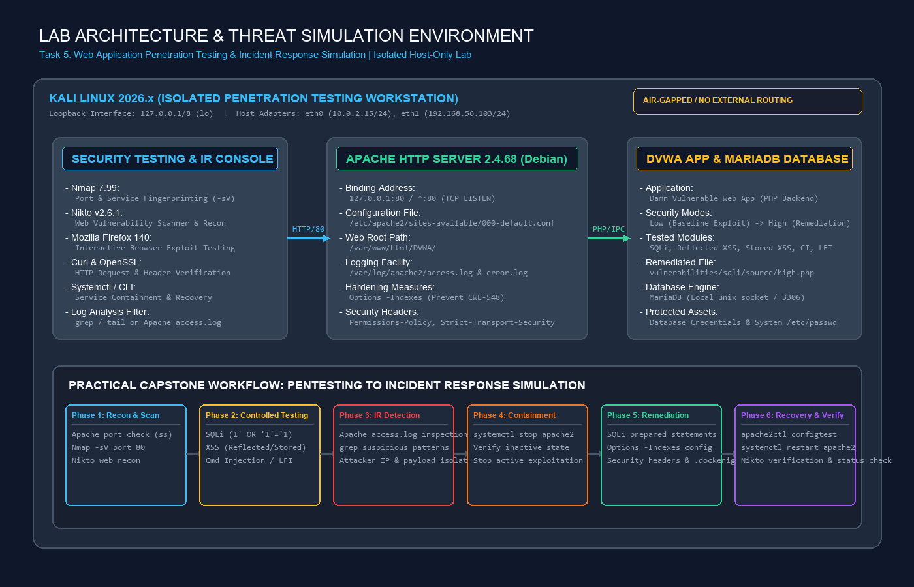

# Web Application Penetration Testing & Incident Response Simulation on DVWA

[](#)
[](#)
[](#)
[](#)
[](#)

---

## 🛡️ Executive Summary

This repository documents the practical execution of **Task 5: Capstone Project & Incident Response Simulation** as part of the **Cybersecurity & Ethical Hacking Internship Program** at **ApexPlanet Software Pvt. Ltd.**

The objective was to conduct an authorized, evidence-based penetration test and simulated incident response against **Damn Vulnerable Web Application (DVWA)** hosted locally on **Kali Linux** (`http://127.0.0.1/DVWA/`). 

The engagement validated five critical vulnerability classes (**SQL Injection**, **Reflected XSS**, **Stored XSS**, **Command Injection**, and **Local File Inclusion**), analyzed Apache server access logs to detect attack signatures, performed service containment, implemented remediation controls (prepared statements, directory indexing restrictions, HTTP security headers, and artifact isolation), and validated recovery with a 90.9% reduction in automated scan alerts.

---

## 🎯 Objectives & Scope

### Project Objectives
- **Reconnaissance & Service Fingerprinting**: Map active ports, web middleware versions, and endpoints using native Linux tools, Nmap, and Nikto.
- **Controlled Vulnerability Verification**: Execute safe, deterministic proof-of-concept tests for OWASP Top 10 vulnerabilities.
- **Incident Response Simulation**: Detect attack patterns within `/var/log/apache2/access.log`, execute emergency service containment, and formulate IoC filters.
- **Hardening & Eradication**: Refactor vulnerable code using prepared statements, eliminate directory indexing (CWE-548), deploy security headers, and isolate sensitive files.
- **Operational Verification**: Verify service recovery and execute rescan audits to validate security posture improvements.

### Engagement Scope & Boundaries
- **Authorized Target**: Local loopback interface `http://127.0.0.1/DVWA/` on Kali Linux.
- **Strict Boundary**: Authorized local testing only. No testing was performed or directed against any external, public, or third-party infrastructure.

---

## 🏗️ Lab Architecture

The testing bed operated in an isolated, host-only environment on Kali Linux, ensuring that all traffic was confined to the local loopback interface (`127.0.0.1`).



### System Components
- **Host Workstation**: Kali Linux (`127.0.0.1/8` loopback interface `lo`)
- **Web Middleware**: Apache HTTP Server `2.4.68 (Debian)` listening on port 80 (`*:80`)
- **Application**: Damn Vulnerable Web Application (DVWA) v1.9+ (`/var/www/html/DVWA/`)
- **Database Backend**: MariaDB (local UNIX socket / port 3306)
- **Logging Facility**: Apache access log (`/var/log/apache2/access.log`)
- **Configuration**: VirtualHost configuration (`/etc/apache2/sites-available/000-default.conf`)

---

## 🔬 Methodology

The assessment followed the **OWASP Web Security Testing Guide (WSTG v4.2)** and **NIST SP 800-61 Rev. 2 (Computer Security Incident Handling Guide)**:

```
[ Reconnaissance ] ➔ [ Service Scanning ] ➔ [ Controlled Testing ]
        │
        ▼
[ Log Detection ]  ➔ [ Service Containment ] ➔ [ Remediation & Hardening ] ➔ [ Recovery Verification ]
```

All findings and statements in this repository are categorized under:
- **OBSERVED FACT**: Directly captured from terminal outputs, HTTP headers, server logs, or screenshots.
- **INFERENCE**: Logical technical deduction based directly on observed facts.
- **RECOMMENDATION**: Industry-standard remediation guidance to eliminate the root cause.

---

## 📊 Vulnerability Findings Matrix

| Finding | Vulnerability Category | Evidence | Qualitative Risk | Remediation Strategy | Verification Status |
|---|---|---|---|---|---|
| **OS Command Injection** | Injection (OWASP A03) | [12-Command-Injection-Executed.png](evidence/exploitation/12-Command-Injection-Executed.png) | **High** | Avoid shell execution wrappers; enforce strict parameter whitelisting. | Controlled PoC verified (`www-data`). |
| **SQL Injection (SQLi)** | Injection (OWASP A03) | [08-SQLi-Vulnerable-Response.png](evidence/exploitation/08-SQLi-Vulnerable-Response.png) | **High** | Implement parameterized queries via prepared statements. | Prepared statements added; syntax OK; functional test verified. |
| **Local File Inclusion (LFI)** | Broken Access Control (OWASP A01) | [13-LFI-Etc-Passwd.png](evidence/exploitation/13-LFI-Etc-Passwd.png) | **High** | Restrict file inclusion parameters to strict whitelist; avoid user-controlled paths. | Controlled PoC verified (`/etc/passwd` exposed). |
| **Stored XSS** | Injection (OWASP A03) | [10-XSS-Stored-Alert.png](evidence/exploitation/10-XSS-Stored-Alert.png) | **Medium** | Sanitize inputs; apply contextual output encoding in DOM. | Controlled PoC verified (`alert` modal executed). |
| **Reflected XSS** | Injection (OWASP A03) | [09-XSS-Reflected-Alert.png](evidence/exploitation/09-XSS-Reflected-Alert.png) | **Medium** | Apply HTML entity encoding (`htmlspecialchars`) on reflected query parameters. | Controlled PoC verified (`alert` modal executed). |
| **Directory Indexing (CWE-548)** | Security Misconfiguration (OWASP A05) | [06-Nikto-Web-Recon.png](evidence/reconnaissance/06-Nikto-Web-Recon.png) | **Low to Medium** | Add `Options -Indexes` to Apache VirtualHost configuration. | **Fully Remediated** (Nikto confirms 4 directory alerts cleared). |
| **Exposed `.dockerignore`** | Security Misconfiguration (OWASP A05) | [06-Nikto-Web-Recon.png](evidence/reconnaissance/06-Nikto-Web-Recon.png) | **Low** | Move repository/build files out of public web root. | **Fully Remediated** (Confirmed HTTP 404 Not Found). |
| **Missing Security Headers** | Security Misconfiguration (OWASP A05) | [06-Nikto-Web-Recon.png](evidence/reconnaissance/06-Nikto-Web-Recon.png) | **Low** | Deploy `Permissions-Policy` and `Strict-Transport-Security` headers. | **Fully Remediated** (Nikto confirms headers present). |
| **Login Page Detected** | Informational Endpoint | [06-Nikto-Web-Recon.png](evidence/reconnaissance/06-Nikto-Web-Recon.png) | **Informational** | Expected login endpoint (`/DVWA/login.php`). Not a vulnerability. | Informational only. |

---

## 🔍 Incident Response Simulation

### 1. Detection (Log Triage)
Real-time inspection of `/var/log/apache2/access.log` using `tail` and regular expression filtering identified active exploit payloads:
```bash
sudo grep -Ei "etc/passwd|union|select|script|or.*=|cmd|127\.0\.0\.1" /var/log/apache2/access.log | tail -n 30
```
- **Observed Fact**: Log records correlated attacks from `127.0.0.1` including `' OR '1'='1`, `<script>alert(...)`, and `../../../../etc/passwd`.

### 2. Containment
Immediate isolation was executed by stopping the Apache service:
```bash
sudo systemctl stop apache2
sudo systemctl is-active apache2  # Output: inactive
```
- **Effect**: Halted all active HTTP connections, neutralizing live exploitation channels.

### 3. Eradication & Hardening
- **SQLi**: Prepared statements introduced into `high.php`; syntax validated with `php -l` (`No syntax errors detected`).
- **Directory Indexing**: Configured `Options -Indexes` in `/etc/apache2/sites-available/000-default.conf`; syntax validated with `apache2ctl configtest` (`Syntax OK`).
- **Security Headers**: Added `Permissions-Policy` and `Strict-Transport-Security` directives.
- **Sensitive Artifact**: Relocated `.dockerignore` to `.dockerignore.bak` outside web access.

### 4. Recovery & Verification
- Services restored and audited:
  ```bash
  sudo systemctl is-active apache2 mariadb
  # Output: active, active
  ```
- Post-remediation Nikto rescan confirmed reported items dropped from **11 items down to 1 informational item** (`/DVWA/login.php`).

---

## 🖼️ Curated Evidence Gallery

| Category | Description | Artifact Preview |
|---|---|---|
| **Reconnaissance** | Apache listening socket & interface check | [02-Apache-Port-80.png](evidence/reconnaissance/02-Apache-Port-80.png) |
| **Scanning** | Nmap port & version detection (`Apache 2.4.68`) | [04-Nmap-Recon-Scan.png](evidence/reconnaissance/04-Nmap-Recon-Scan.png) |
| **Scanning** | Baseline Nikto scan (11 items reported) | [06-Nikto-Web-Recon.png](evidence/reconnaissance/06-Nikto-Web-Recon.png) |
| **Exploitation** | SQL Injection boolean bypass dumping users | [08-SQLi-Vulnerable-Response.png](evidence/exploitation/08-SQLi-Vulnerable-Response.png) |
| **Exploitation** | Reflected XSS executing alert modal | [09-XSS-Reflected-Alert.png](evidence/exploitation/09-XSS-Reflected-Alert.png) |
| **Exploitation** | Command Injection executing `whoami` (`www-data`) | [12-Command-Injection-Executed.png](evidence/exploitation/12-Command-Injection-Executed.png) |
| **Exploitation** | Local File Inclusion disclosing `/etc/passwd` | [13-LFI-Etc-Passwd.png](evidence/exploitation/13-LFI-Etc-Passwd.png) |
| **Detection** | Suspicious attack log entries in `access.log` | [15-Suspicious-Attack-Logs.png](evidence/detection/15-Suspicious-Attack-Logs.png) |
| **Containment** | Apache service stopped (`inactive`) | [16-Incident-Containment-Apache-Stopped.png](evidence/containment/16-Incident-Containment-Apache-Stopped.png) |
| **Remediation** | SQLi syntax check & Apache configtest (`Syntax OK`) | [24-Apache-Directory-Indexing-Config-Test.png](evidence/remediation/24-Apache-Directory-Indexing-Config-Test.png) |
| **Remediation** | Nikto rescan confirming directory indexing fixed | [26-Nikto-After-Directory-Indexing-Fix.png](evidence/remediation/26-Nikto-After-Directory-Indexing-Fix.png) |
| **Remediation** | `.dockerignore` exposure fixed (`404 Not Found`) | [33-Dockerignore-Exposure-Fixed.png](evidence/remediation/33-Dockerignore-Exposure-Fixed.png) |
| **Recovery** | Apache & MariaDB active; final Nikto audit | [35-Recovery-Services-Verified.png](evidence/recovery/35-Recovery-Services-Verified.png) |

---

## 📁 Repository Structure

```text
/
├── README.md                                  # Portfolio landing page and executive summary
├── LICENSE                                    # Open source MIT license
├── .gitignore                                 # Git ignore file for temp and editor artifacts
│
├── docs/                                      # Detailed professional documentation reports
│   ├── 01-project-overview.md                 # Internship context, timeline, and deliverables
│   ├── 02-scope-and-objectives.md             # Boundaries, authorization, in-scope assets
│   ├── 03-lab-architecture.md                 # Network interfaces, technology stack, topology
│   ├── 04-reconnaissance.md                   # Socket audits, IP discovery, endpoint probes
│   ├── 05-scanning.md                         # Nmap service scan and baseline Nikto findings
│   ├── 06-vulnerability-testing.md            # Detailed PoC analysis for SQLi, XSS, CI, LFI
│   ├── 07-findings-and-risk.md                # Full vulnerability matrix and risk assessments
│   ├── 08-remediation.md                      # Code refactoring, Apache hardening, headers
│   ├── 09-incident-response.md                # Detection, IoCs, containment, eradication
│   ├── 10-recovery.md                         # Service restoration, health checks, delta analysis
│   └── 11-post-incident-summary.md            # Lessons learned and enterprise recommendations
│
├── evidence/                                  # Structured, evidence-backed artifacts
│   ├── reconnaissance/                        # Port checks, curl headers, Nmap, baseline Nikto
│   ├── exploitation/                          # SQLi, Reflected XSS, Stored XSS, CI, LFI PoCs
│   ├── detection/                             # Apache access logs, suspicious regex filtering
│   ├── containment/                           # Service halt verification (inactive state)
│   ├── remediation/                           # Prepared statements, config tests, header scans
│   └── recovery/                              # Final Nikto verification, multi-service status
│
├── diagrams/
│   └── network-diagram.png                    # Lab topology & threat simulation workflow
│
├── notes/
│   └── methodology.md                         # PTES, OWASP, NIST guidelines & epistemological rules
│
└── scripts/
    └── README.md                              # Policy regarding native tooling & non-weaponization
```

---

## 💡 Key Lessons Learned

1. **Separation of Code and Data**: Dynamic query string concatenation is the fundamental root cause of SQL injection. Parameterization via prepared statements guarantees that user input cannot alter query structure.
2. **Harden Default Middleware Settings**: Web servers default to permissive configurations unless explicitly hardened. Applying `Options -Indexes` and disabling unnecessary modules eliminates trivial reconnaissance footholds.
3. **Deployment Hygiene**: Internal configuration files, build manifests, and VCS metadata must be strictly excluded from the web document root during deployment.
4. **Log Observability Enables Swift Response**: Verbose, centralized web access logging provides high-fidelity IoCs that allow defenders to trace attacker progression and formulate targeted containment actions.

---

## ⚖️ Legal & Ethical Disclaimer

This project was conducted strictly for educational and internship training purposes within an authorized, isolated local laboratory environment under the **ApexPlanet Software Pvt. Ltd.** Cybersecurity & Ethical Hacking Internship Program. All testing activities were executed against a locally hosted virtual instance of Damn Vulnerable Web Application (DVWA). No unauthorized access, testing, or exploitation was directed toward any real-world, public, or third-party computer systems.
