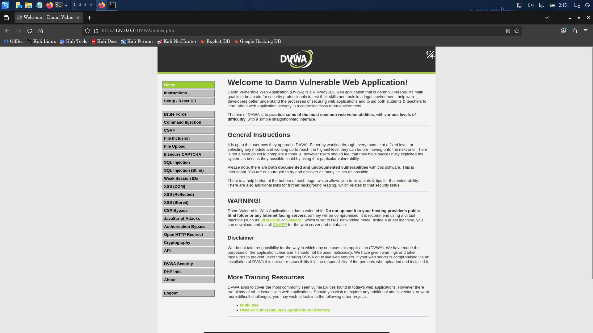

# 04 — Reconnaissance & Asset Discovery

## 1. Network Interface & Socket Verification

Reconnaissance commenced by validating the active host network interfaces and verifying the socket state of local web services.

### Interface Discovery Command
```bash
ip addr
```

**Observed Fact (Evidence: [02-Apache-Port-80.png](../evidence/reconnaissance/02-Apache-Port-80.png))**:
- Loopback adapter `lo`: Assigned `127.0.0.1/8` and `::1/128`.
- Hypervisor adapter `eth0`: Assigned `10.0.2.15/24`.
- Host-only adapter `eth1`: Assigned `192.168.56.103/24`.

### Active Socket Audit Command
```bash
sudo ss -tulpn | grep -E ':80|:443'
```

**Observed Fact (Evidence: [02-Apache-Port-80.png](../evidence/reconnaissance/02-Apache-Port-80.png))**:
```text
tcp   LISTEN 0      511          *:80       *:*    users:(("apache2",pid=2877,fd=4),("apache2",pid=2842,fd=4),("apache2",pid=2115,fd=4),("apache2",pid=2114,fd=4),("apache2",pid=2112,fd=4),("apache2",pid=2111,fd=4),("apache2",pid=2110,fd=4),("apache2",pid=2094,fd=4))
```
- **Inference**: Apache HTTP Server is active and listening on TCP port 80 across all interfaces (`*:80`), spawned across multiple worker processes. Port 443 (HTTPS) showed no active listening socket.

---

## 2. HTTP Endpoint Verification & URL Discovery

Initial probes were conducted using `curl` to verify web server responsiveness and document root path conventions.

### Case-Sensitivity Probe (Negative Test)
```bash
curl -I http://127.0.0.1/dvwa/
```

**Observed Fact (Evidence: [02-Apache-Port-80.png](../evidence/reconnaissance/02-Apache-Port-80.png))**:
```http
HTTP/1.1 404 Not Found
Date: Sun, 06 Sep 2026 06:25:46 GMT
Server: Apache/2.4.68 (Debian)
X-Content-Type-Options: nosniff
X-Frame-Options: SAMEORIGIN
Referrer-Policy: strict-origin-when-cross-origin
Content-Security-Policy: default-src 'self'; script-src 'self' 'unsafe-inline'; style-src 'self' 'unsafe-inline'
Content-Type: text/html; charset=iso-8859-1
```
- **Inference**: Linux web server filesystems are case-sensitive; the lowercase path `/dvwa/` does not exist on the filesystem.

### Exact Endpoint Probe (Positive Test)
```bash
curl -I http://127.0.0.1/DVWA/
```

**Observed Fact (Evidence: [03-DVWA-Endpoint-Verified.png](../evidence/reconnaissance/03-DVWA-Endpoint-Verified.png))**:
```http
HTTP/1.1 302 Found
Date: Sun, 06 Sep 2026 06:27:02 GMT
Server: Apache/2.4.68 (Debian)
X-Content-Type-Options: nosniff
X-Frame-Options: SAMEORIGIN
Referrer-Policy: strict-origin-when-cross-origin
Content-Security-Policy: default-src 'self'; script-src 'self' 'unsafe-inline'; style-src 'self' 'unsafe-inline'
Set-Cookie: security=impossible; path=/; HttpOnly
Set-Cookie: PHPSESSID=b0132d22f1800fbc371cab716ee8fd82; expires=Mon, 07 Sep 2026 06:27:02 GMT; Max-Age=86400; path=/; HttpOnly; SameSite=Strict
Location: login.php
Content-Type: text/html; charset=UTF-8
```
- **Inference**: The correct path `/DVWA/` responds with an HTTP 302 redirect directing unauthenticated clients to `login.php`. Session cookies (`PHPSESSID`) and a default security cookie (`security=impossible`) are issued.

---

## 3. Web Dashboard Verification

Following endpoint confirmation, interactive browser navigation was established via Mozilla Firefox 140.



**Observed Fact (Evidence: [05-DVWA-Dashboard.png](../evidence/reconnaissance/05-DVWA-Dashboard.png))**:
- Successfully accessed `http://127.0.0.1/DVWA/index.php`.
- Dashboard confirms Damn Vulnerable Web Application (DVWA) operational status.
- Left-hand navigation exposed testing modules:
  - Brute Force
  - Command Injection
  - CSRF
  - File Inclusion
  - File Upload
  - Insecure CAPTCHA
  - SQL Injection
  - SQL Injection (Blind)
  - Weak Session IDs
  - XSS (DOM, Reflected, Stored)
  - CSP Bypass, JavaScript Attacks, Authorization Bypass, Open HTTP Redirect, Cryptography, API.
