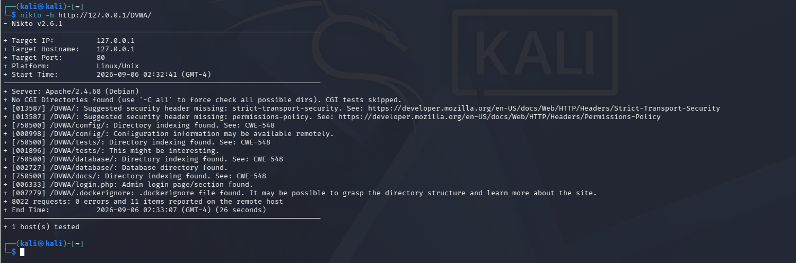

# 05 — Vulnerability Scanning & Service Analysis

## 1. Network Service Scanning (Nmap)

A targeted service version detection scan was conducted using Nmap against the local loopback target.

### Command Execution
```bash
nmap -sV -p 80,443 127.0.0.1
```


### Scan Results & Observed Facts
- **Scanner Version**: Nmap 7.99 (`https://nmap.org`)
- **Timestamp**: `2026-09-06 02:30 -0400`
- **Target**: `localhost (127.0.0.1)`
- **Latency**: `0.000050s`
- **Port 80/tcp**: `open | http | Apache httpd 2.4.68 ((Debian))`
- **Port 443/tcp**: `closed | https`
- **Scan Duration**: Completed 1 IP address in 7.07 seconds.

### Technical Assessment
- **Observed Fact**: HTTP is actively served on TCP port 80 running Apache 2.4.68 on Debian Linux. Port 443 is closed.
- **Inference**: Transport layer security (TLS/HTTPS) is unconfigured on localhost; all HTTP requests and responses traverse unencrypted plaintext channels.

---

## 2. Web Application Vulnerability & Configuration Scanning (Nikto)

Nikto v2.6.1 was executed to assess the web application structure, headers, and directory permissions.

### Command Execution
```bash
nikto -h http://127.0.0.1/DVWA/
```



### Baseline Scan Results & Raw Findings
- **Scanner**: Nikto v2.6.1
- **Target IP / Hostname**: `127.0.0.1` | Port: `80` | Platform: `Linux/Unix`
- **Start Time**: `2026-09-06 02:32:41 (GMT-4)` | End Time: `2026-09-06 02:33:07 (GMT-4)` (Duration: 26 seconds)
- **Total Requests**: 8022 requests, 0 errors, 11 items reported.

#### Raw Findings Table
| Finding Code | Target URI | Raw Nikto Output Description | Classification |
|---|---|---|---|
| `[013587]` | `/DVWA/` | `Suggested security header missing: strict-transport-security.` | Defensive Header Gap |
| `[013587]` | `/DVWA/` | `Suggested security header missing: permissions-policy.` | Defensive Header Gap |
| `[750500]` | `/DVWA/config/` | `Directory indexing found. See: CWE-548` | Misconfiguration (Information Disclosure) |
| `[000998]` | `/DVWA/config/` | `Configuration information may be available remotely.` | Informational Finding |
| `[750500]` | `/DVWA/tests/` | `Directory indexing found. See: CWE-548` | Misconfiguration (Information Disclosure) |
| `[001896]` | `/DVWA/tests/` | `This might be interesting.` | Informational Finding |
| `[750500]` | `/DVWA/database/` | `Directory indexing found. See: CWE-548` | Misconfiguration (Information Disclosure) |
| `[002727]` | `/DVWA/database/` | `Database directory found.` | Informational Finding |
| `[750500]` | `/DVWA/docs/` | `Directory indexing found. See: CWE-548` | Misconfiguration (Information Disclosure) |
| `[006333]` | `/DVWA/login.php` | `Admin login page/section found.` | Informational Endpoint Detection |
| `[007279]` | `/DVWA/.dockerignore` | `.dockerignore file found. It may be possible to grasp the directory structure and learn more about the site.` | Sensitive File Exposure |

---

## 3. Analysis of Baseline Scan Findings

1. **Directory Indexing (CWE-548)**:
   - **Observed Fact**: Apache auto-indexes directories without index files (`/config/`, `/tests/`, `/database/`, `/docs/`), allowing directory listing.
   - **Risk**: Attackers can browse directories, identify backup scripts, schemas, and source artifacts.
2. **Missing HTTP Security Headers**:
   - **Observed Fact**: `Strict-Transport-Security` (HSTS) and `Permissions-Policy` were missing from web server HTTP responses.
   - **Risk**: Browser lacks directive to enforce HTTPS and disable sensitive hardware APIs (e.g., camera, microphone, geolocation).
3. **Information Exposure via `.dockerignore`**:
   - **Observed Fact**: The repository configuration file `.dockerignore` was left inside `/var/www/html/DVWA/` and was directly fetchable via HTTP.
   - **Risk**: Exposes project build exclusions and reveals file paths within the deployment architecture.
4. **Informational Endpoint (`/DVWA/login.php`)**:
   - **Observed Fact**: Nikto detected `login.php`.
   - **Accurate Assessment**: This is an informational detection of an expected application authentication form, NOT a confirmed vulnerability by itself.
