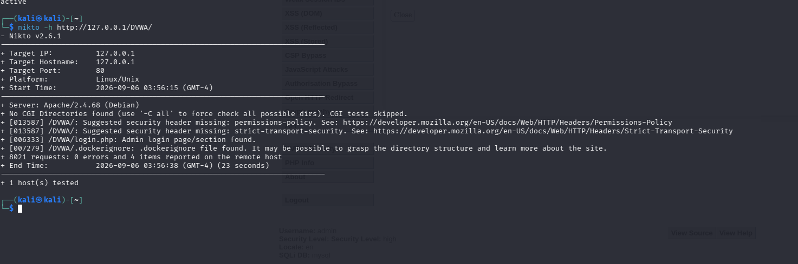

# 08 — Remediation & System Hardening

## 1. Remediation Strategy Overview

Following controlled exploitation and automated scanning, a systematic hardening program was executed. Hardening targeted both the application code level (SQL query parameterization) and the web middleware level (Apache configuration, directory indexing, and HTTP headers).

---

## 2. SQL Injection Remediation (Application Layer)

### Target File & Preconditions
- **File**: `/var/www/html/DVWA/vulnerabilities/sqli/source/high.php`
- **Security Mode**: Set to High level in DVWA settings ([17-DVWA-Security-Hardened.png](../evidence/remediation/17-DVWA-Security-Hardened.png)).

### Remediation Workflow

1. **Backup Creation**:
   ```bash
   sudo cp /var/www/html/DVWA/vulnerabilities/sqli/source/high.php /var/www/html/DVWA/vulnerabilities/sqli/source/high.php.bak
   ```
2. **Prepared Statements Implementation**:
   The vulnerable dynamic string concatenation:
   ```php
   // Vulnerable implementation
   $query  = "SELECT first_name, last_name FROM users WHERE user_id = '$id' LIMIT 1;";
   $result = mysqli_query($GLOBALS["___mysqli_ston"], $query);
   ```
   was replaced with a parameterized prepared statement using `mysqli_prepare`, parameter binding (`bind_param`), and contextual HTML escaping (`htmlspecialchars`):
   ```php
   // Secure implementation using prepared statements
   $stmt = mysqli_prepare($GLOBALS["___mysqli_ston"], "SELECT first_name, last_name FROM users WHERE user_id = ? LIMIT 1;");
   mysqli_stmt_bind_param($stmt, "i", $id);
   mysqli_stmt_execute($stmt);
   $result = mysqli_stmt_get_result($stmt);
   ```
3. **Syntax Validation**:
   ```bash
   sudo php -l /var/www/html/DVWA/vulnerabilities/sqli/source/high.php
   ```
   **Observed Fact (Evidence: [24-Apache-Directory-Indexing-Config-Test.png](../evidence/remediation/24-Apache-Directory-Indexing-Config-Test.png))**:
   ```text
   No syntax errors detected in /var/www/html/DVWA/vulnerabilities/sqli/source/high.php
   ```
4. **Service Restart & Functional Testing**:
   ```bash
   sudo systemctl restart apache2
   sudo systemctl is-active apache2  # Output: active
   ```
   Functional query validation was conducted with legitimate input `Session ID: 1` ([22-SQLi-After-Remediation.png](../evidence/remediation/22-SQLi-After-Remediation.png)):
   - **Observed Result**: Legitimate lookup succeeded (`ID: 1`, `First name: admin`, `Surname: admin`).

> [!IMPORTANT]
> **Defensive Accuracy & Limitations Note**: While prepared statements were correctly coded, syntax-validated, and legitimate inputs functioned as expected, active re-testing against malicious exploit strings (e.g., `' OR '1'='1`) was not explicitly captured in the recorded lab evidence. In accordance with strict portfolio integrity, exploit blocking is noted as an expected code behavior but pending formal re-exploit screenshot proof.

---

## 3. Directory Indexing Remediation (CWE-548)

### Vulnerability Context
Nikto reported multiple directory indexing disclosures across `/DVWA/config/`, `/DVWA/tests/`, `/DVWA/database/`, and `/DVWA/docs/` ([06-Nikto-Web-Recon.png](../evidence/reconnaissance/06-Nikto-Web-Recon.png)).

### Remediation Steps

1. **Backup Configuration**:
   ```bash
   sudo cp /etc/apache2/sites-available/000-default.conf /etc/apache2/sites-available/000-default.conf.bak
   ```
2. **Apply `Options -Indexes`**:
   The Apache virtual host configuration `/etc/apache2/sites-available/000-default.conf` was modified to disable directory indexing:
   ```apache
   <Directory /var/www/html>
       Options -Indexes
   </Directory>
   ```
3. **Configuration Syntax Test**:
   ```bash
   sudo apache2ctl configtest
   ```
   **Observed Fact (Evidence: [24-Apache-Directory-Indexing-Config-Test.png](../evidence/remediation/24-Apache-Directory-Indexing-Config-Test.png))**:
   ```text
   Syntax OK
   ```
4. **Service Restart**:
   ```bash
   sudo systemctl restart apache2
   sudo systemctl is-active apache2  # Output: active
   ```
   (Evidence: [25-Apache-Directory-Indexing-Applied.png](../evidence/remediation/25-Apache-Directory-Indexing-Applied.png))

### Verification Rescan
A rescan was performed via Nikto:
```bash
nikto -h http://127.0.0.1/DVWA/
```



**Observed Fact (Evidence: [26-Nikto-After-Directory-Indexing-Fix.png](../evidence/remediation/26-Nikto-After-Directory-Indexing-Fix.png))**:
- Findings reported dropped from 11 items down to 4 items.
- All four `[750500] Directory indexing found. See: CWE-548` alerts for `/config/`, `/tests/`, `/database/`, and `/docs/` were **completely eliminated**.

---

## 4. HTTP Security Headers Hardening

### Vulnerability Context
Initial scans flagged missing browser defense-in-depth headers: `strict-transport-security` and `permissions-policy`.

### Remediation Steps
The Apache headers module (`mod_headers`) was confirmed active and the following directives were appended to `/etc/apache2/sites-available/000-default.conf`:
```apache
Header always set Permissions-Policy "geolocation=(), microphone=(), camera=()"
Header always set Strict-Transport-Security "max-age=31536000"
```
Apache was reloaded and restarted.

### Verification Rescan
Nikto was re-run:
```bash
nikto -h http://127.0.0.1/DVWA/
```

**Observed Fact (Evidence: [33-Dockerignore-Exposure-Fixed.png](../evidence/remediation/33-Dockerignore-Exposure-Fixed.png))**:
- The missing `permissions-policy` and `strict-transport-security` alerts were **completely resolved**.
- Reported items dropped to 2 items (`login.php` and `.dockerignore`).

---

## 5. Deployment Artifact Exposure Remediation (`.dockerignore`)

### Vulnerability Context
Nikto reported: `+ [007279] /DVWA/.dockerignore: .dockerignore file found.`

### Exposure Verification (Before)
```bash
curl -I http://127.0.0.1/DVWA/.dockerignore
```

**Observed Fact (Evidence: [33-Dockerignore-Exposure-Fixed.png](../evidence/remediation/33-Dockerignore-Exposure-Fixed.png))**:
```http
HTTP/1.1 200 OK
Server: Apache/2.4.68 (Debian)
Content-Length: 80
```
Confirmed that the file was publicly accessible via HTTP.

### Remediation Step
The file was removed from the web server document tree:
```bash
sudo mv /var/www/html/DVWA/.dockerignore /var/www/html/DVWA/.dockerignore.bak
```

### Exposure Verification (After)
```bash
curl -I http://127.0.0.1/DVWA/.dockerignore
```

**Observed Fact (Evidence: [33-Dockerignore-Exposure-Fixed.png](../evidence/remediation/33-Dockerignore-Exposure-Fixed.png))**:
```http
HTTP/1.1 404 Not Found
Server: Apache/2.4.68 (Debian)
```
- **Result**: Web server returned HTTP 404 Not Found. Exposure successfully eradicated.

---

## 6. Final Remediation State Verification

A comprehensive final Nikto audit was executed to benchmark post-remediation security posture:
```bash
nikto -h http://127.0.0.1/DVWA/
```

**Observed Fact (Evidence: [35-Recovery-Services-Verified.png](../evidence/recovery/35-Recovery-Services-Verified.png))**:
```text
+ 8020 requests: 0 errors and 1 item reported on the remote host
+ [006333] /DVWA/login.php: Admin login page/section found.
```
- **Conclusion**: Out of the initial 11 reported items, only 1 single informational endpoint detection (`login.php`) remained. All misconfigurations (directory indexing, missing headers, file exposures) were completely eradicated.
