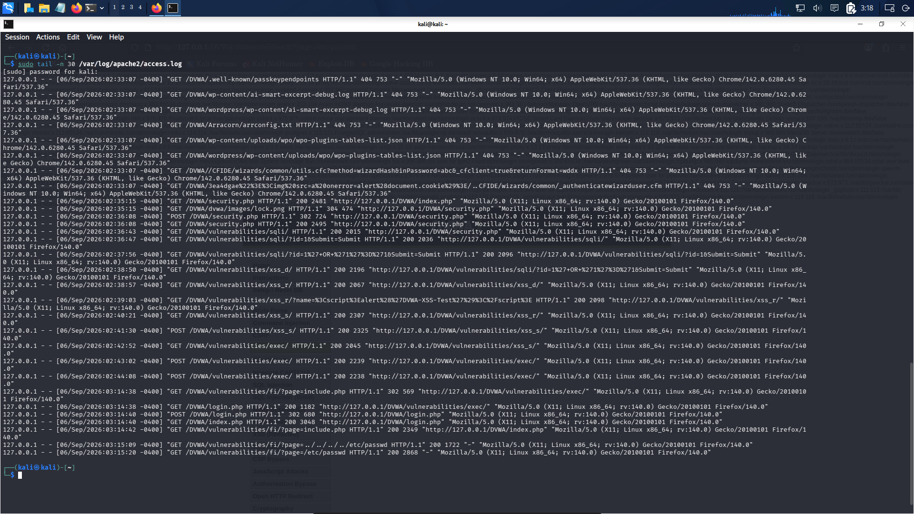

# 09 — Incident Response Simulation (NIST SP 800-61 Rev. 2)

## 1. Incident Overview & Simulation Context

As part of the capstone project, an end-to-end incident response simulation was conducted against the local DVWA target. The objective was to transition from offensive vulnerability discovery into defensive blue-team operations: detecting the attack within system logs, performing triage, executing rapid containment, and planning eradication.

> [!NOTE]
> This incident was a controlled exercise conducted on localhost (`127.0.0.1`). No unauthorized external actors were involved.

---

## 2. Phase 1: Incident Detection & Log Analysis

The primary detection mechanism relied on the Apache HTTP access logging facility located at `/var/log/apache2/access.log`.

### Step 1: Real-Time Log Inspection
The incident responder reviewed recent access log entries:
```bash
sudo tail -n 30 /var/log/apache2/access.log
```



**Observed Fact (Evidence: [14-Apache-Attack-Logs.png](../evidence/detection/14-Apache-Attack-Logs.png))**:
The log revealed clear traces of automated reconnaissance followed by targeted manual injection attacks:
1. Automated Nikto probes targeting WordPress plugins, ColdFusion, and known endpoints (returning HTTP 404).
2. **SQL Injection**:
   ```text
   127.0.0.1 - - [06/Sep/2026:02:37:56 -0400] "GET /DVWA/vulnerabilities/sqli/?id=1%27+OR+%271%27%3D%271&Submit=Submit HTTP/1.1" 200 2096
   ```
3. **Reflected XSS**:
   ```text
   127.0.0.1 - - [06/Sep/2026:02:39:03 -0400] "GET /DVWA/vulnerabilities/xss_r/?name=%3Cscript%3Ealert%28%27DVWA-XSS-Test%27%29%3C%2Fscript%3E HTTP/1.1" 200 2098
   ```
4. **Stored XSS**:
   ```text
   127.0.0.1 - - [06/Sep/2026:02:41:30 -0400] "POST /DVWA/vulnerabilities/xss_s/ HTTP/1.1" 200 2325
   ```
5. **Command Injection**:
   ```text
   127.0.0.1 - - [06/Sep/2026:02:44:08 -0400] "POST /DVWA/vulnerabilities/exec/ HTTP/1.1" 200 2238
   ```
6. **Local File Inclusion (LFI)**:
   ```text
   127.0.0.1 - - [06/Sep/2026:03:15:09 -0400] "GET /DVWA/vulnerabilities/fi/?page=../../../../etc/passwd HTTP/1.1" 200 1722
   127.0.0.1 - - [06/Sep/2026:03:15:20 -0400] "GET /DVWA/vulnerabilities/fi/?page=/etc/passwd HTTP/1.1" 200 2868
   ```

---

## 3. Phase 2: Threat Hunting & Targeted IoC Extraction

To isolate high-fidelity indicators of compromise (IoCs) across noisy web traffic, a targeted regular expression filter was applied:

### Log Filtering Command
```bash
sudo grep -Ei "etc/passwd|union|select|script|or.*=|cmd|127\.0\.0\.1" /var/log/apache2/access.log | tail -n 30
```


### Extracted Indicators of Compromise (IoCs)
- **Source IP Address**: `127.0.0.1` (Local loopback)
- **User-Agent String**: `Mozilla/5.0 (X11; Linux x86_64; rv:140.0) Gecko/20100101 Firefox/140.0`
- **Targeted Application Paths**:
  - `/DVWA/vulnerabilities/sqli/`
  - `/DVWA/vulnerabilities/xss_r/`
  - `/DVWA/vulnerabilities/xss_s/`
  - `/DVWA/vulnerabilities/exec/`
  - `/DVWA/vulnerabilities/fi/`
- **Observed Response Codes**: HTTP `200 OK` across all attack vectors, confirming the server processed and responded to the malicious requests.

---

## 4. Phase 3: Immediate Incident Containment

To halt ongoing exploitation and prevent data exfiltration, the incident responder initiated immediate containment by terminating the web server daemon.

### Containment Command Execution
```bash
sudo systemctl stop apache2
sudo systemctl is-active apache2
```


**Observed Fact (Evidence: [16-Incident-Containment-Apache-Stopped.png](../evidence/containment/16-Incident-Containment-Apache-Stopped.png))**:
- Service state returned: `inactive`
- **Effect of Containment**: The attack surface was immediately severed. Port 80 was no longer accepting incoming TCP connections, neutralizing ongoing automated or interactive exploitation attempts.

---

## 5. Phase 4: Eradication & Hardening

During the containment window, defensive engineering actions were applied:
1. **Source Code Hardening**: Replaced raw dynamic SQL in `high.php` with parameterized prepared statements.
2. **Web Server Hardening**: Configured `Options -Indexes` in Apache to eliminate directory traversal/browsing.
3. **HTTP Defensive Headers**: Injected `Permissions-Policy` and `Strict-Transport-Security`.
4. **Information Cleanup**: Removed `.dockerignore` from the public document tree.

*(Full technical details are documented in [08-remediation.md](08-remediation.md)).*

---

## 6. Phase 5: Recovery & Post-Incident Verification

The recovery procedure restored services under rigorous pre-flight checks:
1. Validating syntax with `apache2ctl configtest` (`Syntax OK`).
2. Restarting Apache via `systemctl restart apache2`.
3. Confirming active service states via `systemctl is-active apache2 mariadb` (`active` / `active`).
4. Running verification scans via Nikto.

*(Full technical details are documented in [10-recovery.md](10-recovery.md)).*
