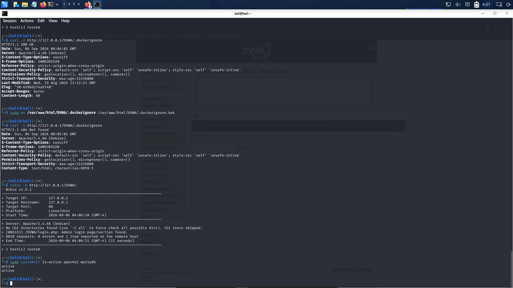

# 10 — Recovery & Verification Auditing

## 1. Post-Remediation Recovery Workflow

Following the application of system hardening patches and remediation controls, a systematic recovery plan was executed to restore production services while ensuring that vulnerabilities were definitively closed.

```
+-------------------------------------------------------------+
|                STEP 1: CONFIGURATION VALIDATION             |
|   apache2ctl configtest  ==>  Syntax OK                     |
+------------------------------+------------------------------+
                               |
                               v
+-------------------------------------------------------------+
|                STEP 2: SERVICE RESTORATION                  |
|   systemctl restart apache2                                 |
+------------------------------+------------------------------+
                               |
                               v
+-------------------------------------------------------------+
|                STEP 3: MULTI-SERVICE HEALTH CHECK           |
|   systemctl is-active apache2 mariadb  ==> active / active  |
+------------------------------+------------------------------+
                               |
                               v
+-------------------------------------------------------------+
|                STEP 4: POST-RECOVERY SECURITY SCAN          |
|   nikto -h http://127.0.0.1/DVWA/  ==> 1 informational item |
+-------------------------------------------------------------+
```

---

## 2. Multi-Service Operational State Audit

To confirm that all core dependencies were functional and running without errors, service states were queried simultaneously:

### Command Execution
```bash
sudo systemctl is-active apache2 mariadb
```



**Observed Fact (Evidence: [35-Recovery-Services-Verified.png](../evidence/recovery/35-Recovery-Services-Verified.png))**:
```text
active
active
```
- **Apache HTTP Daemon (`apache2`)**: Active and operational.
- **MariaDB Relational Database (`mariadb`)**: Active and operational.

---

## 3. Post-Recovery Vulnerability Verification Rescan

A full automated Nikto vulnerability scan was re-run against the hardened target to verify that previously identified security gaps were resolved.

### Final Scan Execution
```bash
nikto -h http://127.0.0.1/DVWA/
```

**Observed Fact (Evidence: [35-Recovery-Services-Verified.png](../evidence/recovery/35-Recovery-Services-Verified.png))**:
- **Scanner Output**:
  ```text
  - Nikto v2.6.1
  + Target IP: 127.0.0.1
  + Target Hostname: 127.0.0.1
  + Target Port: 80
  + Platform: Linux/Unix
  + Start Time: 2026-09-06 04:06:10 (GMT-4)
  + Server: Apache/2.4.68 (Debian)
  + No CGI Directories found (use '-C all' to force check all possible dirs). CGI tests skipped.
  + [006333] /DVWA/login.php: Admin login page/section found.
  + 8020 requests: 0 errors and 1 item reported on the remote host
  + End Time: 2026-09-06 04:06:31 (GMT-4) (21 seconds)
  + 1 host(s) tested
  ```

---

## 4. Delta Analysis: Before vs. After Hardening

| Assessment Dimension | Baseline State (Pre-Remediation) | Hardened State (Post-Recovery) | Status |
|---|---|---|---|
| **Nikto Reported Items** | 11 items reported | **1 item reported** | 90.9% reduction in surface alerts |
| **Directory Indexing (CWE-548)** | 4 directories exposed (`config`, `tests`, `database`, `docs`) | **0 directories exposed** | Fully Remediated |
| **Missing HTTP Security Headers** | Missing `HSTS` and `Permissions-Policy` | **Headers properly enforced** | Fully Remediated |
| **Configuration Exposure** | `.dockerignore` accessible via HTTP 200 | **HTTP 404 Not Found** | Fully Remediated |
| **Remaining Finding** | Multiple high and medium risks | `/DVWA/login.php` (Informational only) | Verified Acceptable Baseline |
| **Service Health** | Uncontrolled exposure | `apache2` active, `mariadb` active | Verified Healthy |
